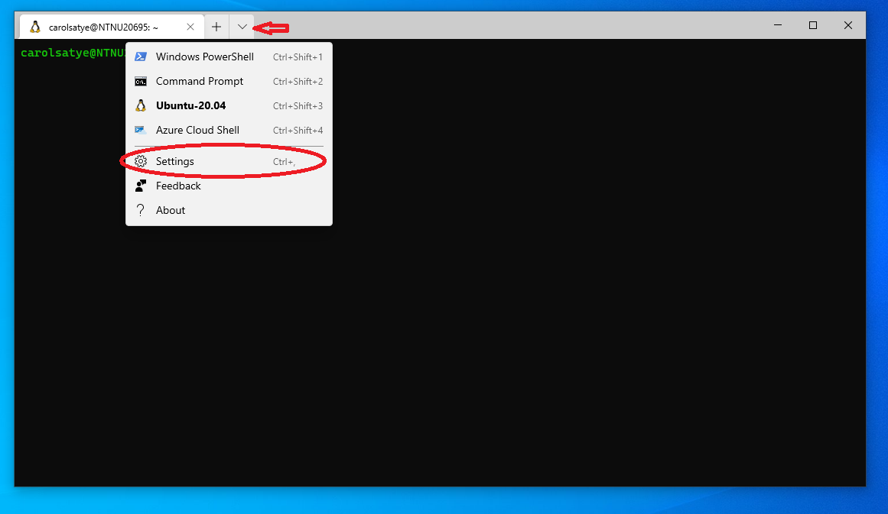
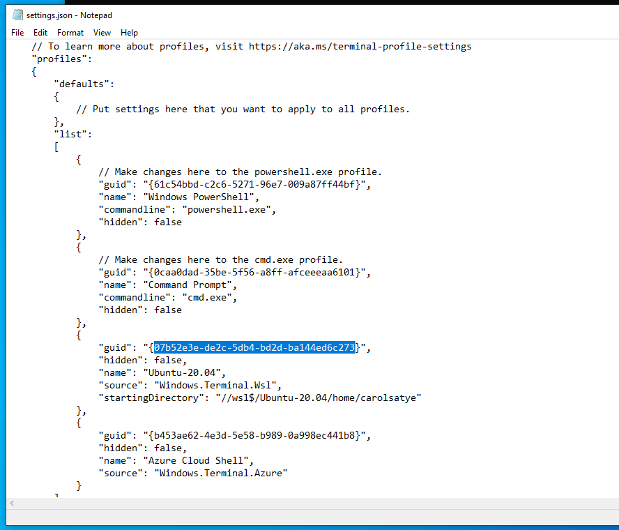
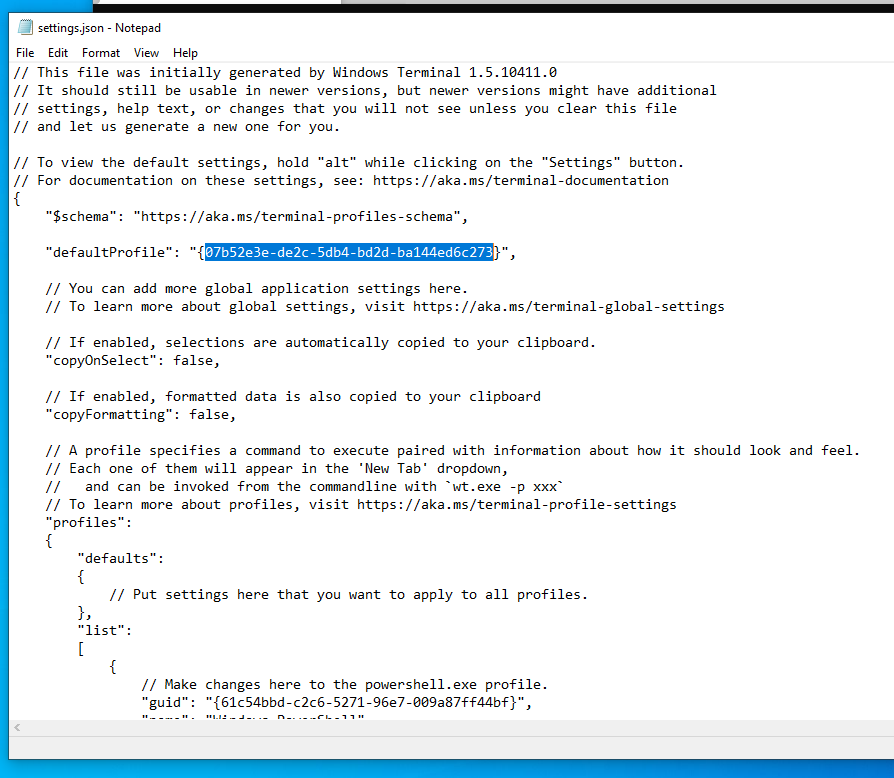
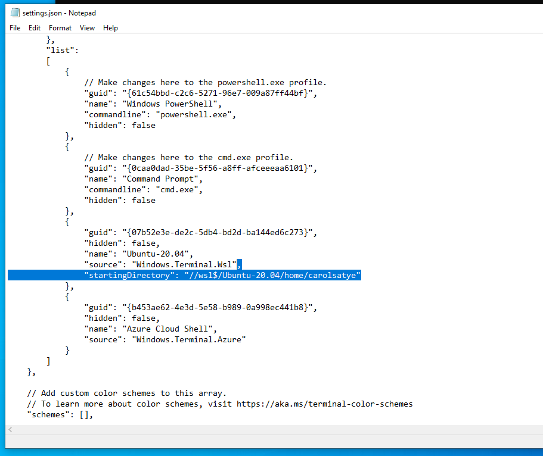
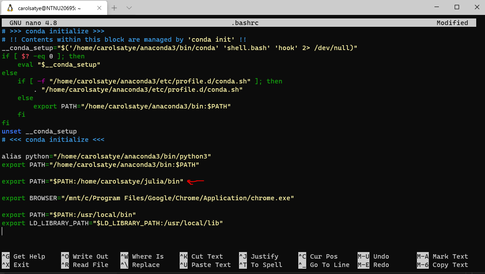
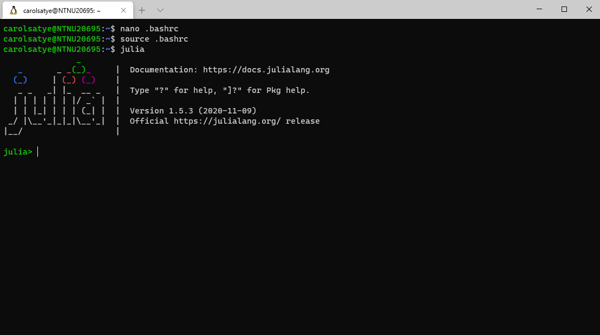

# Working with Julia in Linux from your Windows computer

We can now run programs in Linux from Windows without the use of a virtual machine. Both systems are integrated so we can run our codes in Linux, while having all apps in Windows, including [Visual Studio Code](https://code.visualstudio.com/). For that, you first need to install the Windows Subsystem for Linux (WSL) in your machine and then you can install whatever you need to run your codes in Linux.

>**IMPORTANT:**
If you are doing this in an NTNU computer, the first thing you have to do (if you haven't done it already) is go to the IT office and ask them to make your user administrator so you can install things.

In this guide, we show how to install WSL, get Julia, and install Ipopt with the HSL linear solvers.

>**IMPORTANT:**
You should get the academic version of the HSL linear solver first. You need to request it at the [HSL website](https://www.hsl.rl.ac.uk/ipopt/) using your NTNU email and wait for them to send the download link. You should request the **source** for the **Full (Stable)** version. [Here](http://www.hsl.rl.ac.uk/download/coinhsl/2015.06.23/) is a direct link for requesting these files. It takes about one day for them to respond. (If given the option, download the .tar.gz file)

&nbsp;

## Windows Subsystem for Linux

You can follow the instructions shown [here](https://docs.microsoft.com/en-us/windows/wsl/install-win10). In an NTNU computer, you need to follow the **Manual Installation Steps**

A few suggestions regarding this installation:

- If you are using an NTNU computer, you can just skip Step 2.
- I recommend getting an Ubuntu distribution. Most people use it and it is easier to get help. Also, the steps bellow are for a Debian based system, like Ubuntu. (Personally I tend to get the latest version.)
- When choosing a username, it can be whatever you want, it does not have to match your NTNU username.
- I recommend installing the Windows Terminal (optional step in the instructions). If you want it to open directly in the Linux environment, here is what you need to do:

First, open the Windows Terminal settings file


<!--  -->

&nbsp;

Scroll down a little, find the Ubuntu(Linux) profile, and copy the corresponding guid


<!--  -->

&nbsp;

Scroll back up and substitute the value in "defaultProfile".


<!--  -->

&nbsp;

Now when you open the Windows Terminal, it will open in your user home directory of your Windows. If you want it to open in the home directory of your Linux system (WSL), you can add a new field to the Ubuntu(Linux) block in profiles


<!--  -->

&nbsp;

In your case, the line should be

```js
"startingDirectory": "//wsl$/(what is written in the field name)/home/(your linux username)"
```

If you close and open Windows Terminal, it should now open in your Linux system.

&nbsp;

## Adding some dependencies in the Linux system

There are some dependencies that you need to install in your Linux before we continue.

Run

```console
username@NTNUxxxxx:~$ sudo apt install build-essential
```

Ipopt requires some aditional packages. Run

```console
username@NTNUxxxxx:~$ sudo apt-get install gcc g++ gfortran git patch wget pkg-config liblapack-dev libmetis-dev
```

(Note for beginners in Linux: `sudo` runs the command as administrator.)

&nbsp;

## Getting Julia

Since the Linux system does not have a graphic interface, we need to download julia from the command line (or download in Windows and move to the Linux environment). The latest stable version at the time this guide was written was 1.5.3. So, to download Julia, run

```console
username@NTNUxxxxx:~$ wget https://julialang-s3.julialang.org/bin/linux/x64/1.5/julia-1.5.3-linux-x86_64.tar.gz
```

You can get other versions of julia by getting the corresponding address at their [download page](https://julialang.org/downloads/). Just substitute the address in the command above.

You can list the files and folders in your current directory by running

```console
username@NTNUxxxxx:~$ ls
```

The file `julia-1.5.3-linux-x86_64.tar.gz` (or the one you downloaded) should be there.

Extract the files using the command (with the appropriate file name)

```console
username@NTNUxxxxx:~$ tar -xvf julia-1.5.3-linux-x86_64.tar.gz
```

If you type `ls` again, you should now see a folder called `julia-1.5.3`.

Now you should make julia available for the entire Linux system. One way of doing that is by adding the path to Julia to the `.bashrc` file. Make sure you are in the home directory by typing

```console
username@NTNUxxxxx:~$ cd
```

Now let's open the `.bashrc` file using `nano`

```console
username@NTNUxxxxx:~$ nano .bashrc
```

Go to the end of the file and add the line

```file
export PATH="$PATH:/home/(linux username)/julia-1.5.3/bin"
```




Press `Ctrl + O` and then `Enter` to save, and then `Crtl + X` to exit.

You now need to reaload `.bashrc`, which can be done by running

```console
username@NTNUxxxxx:~$ source .bashrc
```

If you now type `julia` in the console, Julia should start.



&nbsp;

>**NOTE:**
If you want to have more than one version of Julia installed, you can create an alias for the other versions. For example, if you also download Julia v.1.0.5, you can add the line `alias julia105="/home/(linux username)/julia-1.0.5/bin/julia"` to the end of the `.bashrc` file. This version should start by typing `julia105` on the command line.

&nbsp;

## Compiling Ipopt with HSL Linear Solvers

We will mostly follow the instructions from [Ipopt documentation](https://coin-or.github.io/Ipopt/INSTALL.html). However, there are some steps that we can skip and a couple of other steps that are necessary and are not described there.

You first need to download and install a couple of dependencies. Go to the directory where you want to put them. (Personally I just put in the home directory. Just type `cd` and press `Enter` to make sure you are in the home directory if you would like to do the same)

### ASL (Ampl Solver Library)

First you need to clone the ThirdParty-ASL git repository

```console
username@NTNUxxxxx:~$ git clone https://github.com/coin-or-tools/ThirdParty-ASL.git
```

Go inside the folder and run the `get.ASL` file

```console
username@NTNUxxxxx:~$ cd ThirdParty-ASL
username@NTNUxxxxx:~/ThirdParty-ASL$ ./get.ASL
```

Then run the configure file, compile, install, and go back to the home directory (or the location where you are putting the dependencies )

```console
username@NTNUxxxxx:~/ThirdParty-ASL$ ./configure
(output)
username@NTNUxxxxx:~/ThirdParty-ASL$ make
(output)
username@NTNUxxxxx:~/ThirdParty-ASL$ sudo make install
(output)
username@NTNUxxxxx:~/ThirdParty-ASL$ cd ..
username@NTNUxxxxx:~$
```

### HSL (Harwell Subroutines Library) Solvers

You probably downloaded the file in Windows, so you need to make it available in the Linux system. One way you can do that is by accessing the folder where the file you downloaded (mine was called `coinhsl-2015.06.23.tar.gz`) is saved in Windows and copying it to the Linux home directory (or where you are saving the dependencies). If the file is saved in the `Downloads` folder

```console
username@NTNUxxxxx:~$ cd /mnt/c/Users/(NTNU username)/Downloads
username@NTNUxxxxx:/mnt/c/Users/(NTNU username)/Downloads$ cp coinhsl-2015.06.23.tar.gz ~
```

Go back to the home directory and make sure the file is there

```console
username@NTNUxxxxx:/mnt/c/Users/(NTNU username)/Downloads$ cd
username@NTNUxxxxx:~$ ls
(list of files and folders) coinhsl-2015.06.23.tar.gz
```

Extract the content of the file and rename the folder to `coinhsl`

```console
username@NTNUxxxxx:~$ tar -xvf coinhsl-2015.06.23.tar.gz
(output)
username@NTNUxxxxx:~$ mv coinhsl-2015.06.23/ coinhsl 
```

Now you need to clone a git repository that will help us install the solvers

```console
username@NTNUxxxxx:~$ git clone https://github.com/coin-or-tools/ThirdParty-HSL.git
```

Access the `ThirdParty-HSL` folder and move the `coinhsl` folder inside

```console
username@NTNUxxxxx:~$ cd ThirdParty-HSL
username@NTNUxxxxx:~/ThirdParty-HSL$ mv ../coinhsl .
```

You can now configure, compile and install the HSL solvers

```console
username@NTNUxxxxx:~/ThirdParty-HSL$ ./configure
(output)
username@NTNUxxxxx:~/ThirdParty-HSL$ make
(output)
username@NTNUxxxxx:~/ThirdParty-HSL$ sudo make install
(output)
```

Ipopt uses the new libraries that were added to the system, but it looks for a different name than the one created. Therefore, you need to create a symbolic link to those libraries with the name that Ipopt looks for. First, go to folder where the libraries are and list the files

```console
username@NTNUxxxxx:~/ThirdParty-HSL$ cd /usr/local/lib
username@NTNUxxxxx:/usr/local/lib$ ls
```

There should be 4 files called `libcoinhsl` with different extentions. Ipopt will look for `libhsl`, so you can create a symbolic link for each of the `libcoinhsl` file (pay attention to the extensions you have, they might not be the same as the ones here) by running

```console
username@NTNUxxxxx:/usr/local/lib$ sudo ln -s libcoinhsl.la libhsl.la
username@NTNUxxxxx:/usr/local/lib$ sudo ln -s libcoinhsl.so libhsl.so
username@NTNUxxxxx:/usr/local/lib$ sudo ln -s libcoinhsl.so.2 libhsl.so.2
username@NTNUxxxxx:/usr/local/lib$ sudo ln -s libcoinhsl.so.2.2.0 libhsl.so.2.2.0
```

Go back to the home directory

```console
username@NTNUxxxxx:/usr/local/lib$ cd
username@NTNUxxxxx:~$
```

### Ipopt

We can now download and compile Ipopt. First clone the Ipopt repository and access the Ipopt folder

```console
username@NTNUxxxxx:~$ git clone https://github.com/coin-or/Ipopt.git
username@NTNUxxxxx:~$ cd Ipopt
```

You can create a directory now where Ipopt will be compiled and access it

```console
username@NTNUxxxxx:~/Ipopt$ mkdir build
username@NTNUxxxxx:~/Ipopt$ cd build
```

You can now configure, compile, test and install Ipopt

```console
username@NTNUxxxxx:~/Ipopt/build$ ../configure
(output)
username@NTNUxxxxx:~/Ipopt/build$ make
(output)
username@NTNUxxxxx:~/Ipopt/build$ make test
(output - make sure they all pass)
username@NTNUxxxxx:~/Ipopt/build$ sudo make install
(output)
```

Now let's see if the executable is where it is supposed to be. There should be two files realted to Ipopt there.

```console
username@NTNUxxxxx:~/Ipopt/build$ cd /usr/local/bin
username@NTNUxxxxx:/usr/local/bin$ ls
ipopt  ipopt_sens  
```

You need to make the executable and libraries available for Julia to find them. This can be done by adding the path to the system's `PATH` variable the same way we did for Julia. So go to the home directory and edit the `.bashrc` file

```console
username@NTNUxxxxx:/usr/local/bin$ cd 
username@NTNUxxxxx:~$ nano .bashrc
```

Go to the end of file and add these two lines

```file
export PATH="$PATH:/usr/local/bin"
export LD_LIBRARY_PATH="$LD_LIBRARY_PATH:/usr/local/lib"
```

Now save by pressing `Crtl + O` and `Enter`, and exit, `Crtl + X`. Reload the `.bashrc` file

```console
username@NTNUxxxxx:~$ source .bashrc
```

&nbsp;

## Using the Compiled Ipopt in Julia

Now let's make sure Julia uses the Ipopt version you have just compiled. Start Julia in the terminal

```console
username@NTNUxxxxx:~$ julia
```

First you need to add the Ipopt package (and also JuMP, if you haven't, for us to test Ipopt)

```julia
julia> import Pkg
julia> Pkg.add("Ipopt")
(output)
julia> Pkg.add("JuMP")
(output)
```

>**NOTE:** using the closing square bracket ] to add Ipopt does **NOT** work if you intend to use the compiled Ipopt executable as we are doing

Now you need to change the path to Ipopt in Julia

```julia
julia> ENV["JULIA_IPOPT_EXECUTABLE_PATH"] = "usr/local/bin"
julia> ENV["JULIA_IPOPT_LIBRARY_PATH"] = "usr/local/lib"
julia> Pkg.build("Ipopt")
```

You can test it now with this simple problem (just copy and paste it in the Julia REPL in the terminal)

```julia
using Ipopt, JuMP
optimizer = with_optimizer(Ipopt.Optimizer, linear_solver = "ma97")
model = Model(optimizer)
@variable(model, 0 <= x <= 2)
@variable(model, 0 <= y <= 30)
@objective(model, Max, 5x + 3 * y)
@constraint(model, con, 1x + 5y <= 3)
```

Hopefully, everything is working fine.

&nbsp;

## Some Additional Comments

- You can install the WSL extension in VSCODE. You then have two environments in VSCODE and can run your codes with Windows or Linux innstallations.
- You can access files in your Windows system from Linux by accessing the Windows 'C:/' directory

```console
username@NTNUxxxxx:~$ cd /mnt/c
```

From there you navigate normally and can access any folder in Windows, including our OneDrive directory

```console
username@NTNUxxxxx:/mnt/c$ cd Users/(NTNU username)/'OneDrive - NTNU'
username@NTNUxxxxx:/mnt/c/Users/(NTNU username)/OneDrive - NTNU$
```

- When using the command line in Linux, `cd` takes you to the specified directory, one dot ( . ) corresponds to the current directory, two dots ( .. ) correspond to the parent directory and tilde ( ~ ) corresponds to the home directory.
